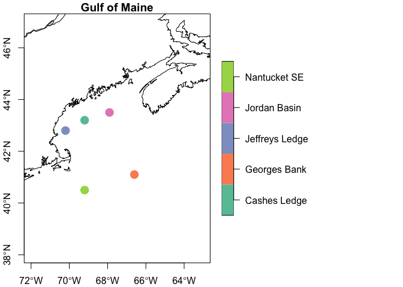
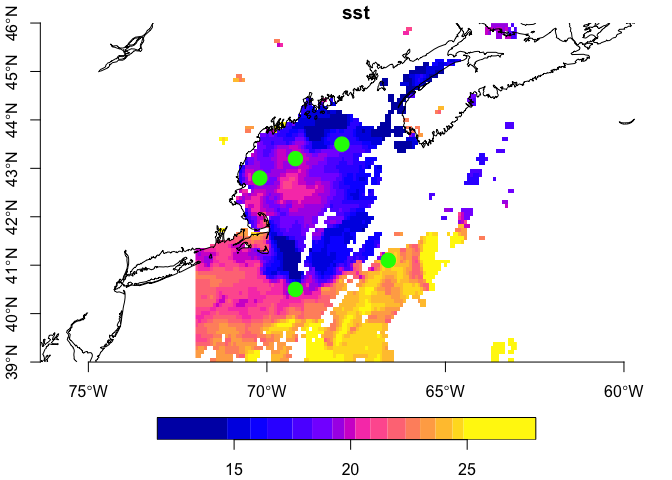
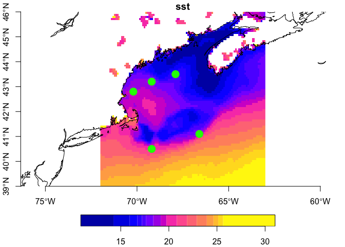

obpg
================

Access OPeNDAP [OBPG](https://oceancolor.gsfc.nasa.gov/) data from R.
Extract point or bounded boxes (as raster).

Find a catalog of the available OBPG data offerings
[here](https://oceandata.sci.gsfc.nasa.gov/opendap/)

## Requirements

- [R v4.1+](https://www.r-project.org/)

Packages from CRAN:

- [rlang](https://CRAN.R-project.org/package=rlang)
- [dplyr](https://CRAN.R-project.org/package=httr)
- [sf](https://CRAN.R-project.org/package=sf)
- [stars](https://CRAN.R-project.org/package=stars)
- [thredds](https://CRAN.R-project.org/package=thredds)
- [tidyr](https://CRAN.R-project.org/package=tidyr)
- [ncdf4](https://CRAN.R-project.org/package=ncdf4)

## Installation

    remotes::install_github("BigelowLab/obpg")

### Usage

``` r
suppressPackageStartupMessages({
  library(rnaturalearth)
  library(dplyr)
  library(sf)
  library(stars)
  library(obpg)
})
```

#### Working with points and bounding boxes.

See the [xyzt](https://github.com/BigelowLab/xyzt) package for more
details on the example Gulf of Maine data; the location data following
is adapted from that package. Here we make a bounding box and a
selection of points. We also load a coastline from
[NaturalEarth](https://www.naturalearthdata.com/) to use with plotting.

``` r
coast = rnaturalearth::ne_coastline(returnclass = 'sf', scale = "large")
gom_box = c(xmin =  -72,
            xmax = -63,
            ymin = 39,
            ymax = 46) |>
  sf::st_bbox(crs = 4326)

points = dplyr::tribble(
     ~id,            ~name,   ~lon,  ~lat,               
  "44098", "Jeffreys Ledge", -70.2,  42.8,
  "44005", "Cashes Ledge",   -69.2,  43.2,
  "44037", "Jordan Basin",   -67.9,  43.5,
  "44011", "Georges Bank",   -66.6,  41.1,
  "44008", "Nantucket SE",   -69.2,  40.5,) |>
  sf::st_as_sf(coords = c("lon", "lat"), crs = 4326)

plot(points['name'], axes = TRUE, main = "Gulf of Maine", 
     extent = gom_box, reset = FALSE, key.width = lcm(8), pch = 16, cex = 2)
plot(sf::st_geometry(coast), add = TRUE, border = "black")
```

<!-- -->

Create a URL for one of the (many) available resources at
[OBPG](https://oceandata.sci.gsfc.nasa.gov/opendap/). And then open the
resource - it’s a NetCDF. Printed below is a summary of the contents of
the resource including the variables and the dimensions over which the
are defined.

``` r
# generate a OBPG url for a given date
url <- obpg_url(date = "2020-07-12",
                mission = "MODIS",
                instrument = "AQUA",
                period = "DAY",
                product = "SST.sst",
                resolution = "9km")

# open the resource
X <- ncdf4::nc_open(url)
X
```

    ## File https://oceandata.sci.gsfc.nasa.gov/opendap/MODISA/L3SMI/2020/0712/AQUA_MODIS.20200712.L3m.DAY.SST.sst.9km.nc (NC_FORMAT_CLASSIC):
    ## 
    ##      3 variables (excluding dimension variables):
    ##         byte palette[eightbitcolor,rgb]   
    ##         short sst[lon,lat]   
    ##             long_name: Sea Surface Temperature
    ##             scale_factor: 0.00499999988824129
    ##             add_offset: 0
    ##             units: degree_C
    ##             standard_name: sea_surface_temperature
    ##             _FillValue: -32767
    ##             valid_min: -1000
    ##             valid_max: 10000
    ##             display_scale: linear
    ##             display_min: -2
    ##             display_max: 45
    ##         byte qual_sst[lon,lat]   
    ##             long_name: Quality Levels, Sea Surface Temperature
    ##             _FillValue: -1
    ##             valid_min: 0
    ##             valid_max: 5
    ## 
    ##      4 dimensions:
    ##         eightbitcolor  Size:256 (no dimvar)
    ##         lat  Size:2160 
    ##             long_name: Latitude
    ##             units: degrees_north
    ##             standard_name: latitude
    ##             _FillValue: -999
    ##             valid_min: -90
    ##             valid_max: 90
    ##         lon  Size:4320 
    ##             long_name: Longitude
    ##             units: degrees_east
    ##             standard_name: longitude
    ##             _FillValue: -999
    ##             valid_min: -180
    ##             valid_max: 180
    ##         rgb  Size:3 (no dimvar)
    ## 
    ##     61 global attributes:
    ##         product_name: AQUA_MODIS.20200712.L3m.DAY.SST.sst.9km.nc
    ##         instrument: MODIS
    ##         title: MODISA Level-3 Standard Mapped Image
    ##         project: Ocean Biology Processing Group (NASA/GSFC/OBPG)
    ##         platform: Aqua
    ##         temporal_range: day
    ##         processing_version: R2019.0
    ##         date_created: 2020-08-22T03:07:40.000Z
    ##         history: l3mapgen par=AQUA_MODIS.20200712.L3m.DAY.SST.sst.9km.nc.param 
    ##         l2_flag_names: LAND,HISOLZEN
    ##         time_coverage_start: 2020-07-12T01:00:01.000Z
    ##         time_coverage_end: 2020-07-13T02:20:00.000Z
    ##         start_orbit_number: 96750
    ##         end_orbit_number: 96766
    ##         map_projection: Equidistant Cylindrical
    ##         latitude_units: degrees_north
    ##         longitude_units: degrees_east
    ##         northernmost_latitude: 90
    ##         southernmost_latitude: -90
    ##         westernmost_longitude: -180
    ##         easternmost_longitude: 180
    ##         geospatial_lat_max: 90
    ##         geospatial_lat_min: -90
    ##         geospatial_lon_max: 180
    ##         geospatial_lon_min: -180
    ##         latitude_step: 0.0833333358168602
    ##         longitude_step: 0.0833333358168602
    ##         sw_point_latitude: -89.9583358764648
    ##         sw_point_longitude: -179.95832824707
    ##         spatialResolution: 9.28 km
    ##         geospatial_lon_resolution: 0.0833333358168602
    ##         geospatial_lat_resolution: 0.0833333358168602
    ##         geospatial_lat_units: degrees_north
    ##         geospatial_lon_units: degrees_east
    ##         number_of_lines: 2160
    ##         number_of_columns: 4320
    ##         measure: Mean
    ##         suggested_image_scaling_minimum: -2
    ##         suggested_image_scaling_maximum: 45
    ##         suggested_image_scaling_type: LINEAR
    ##         suggested_image_scaling_applied: No
    ##         _lastModified: 2020-08-22T03:07:40.000Z
    ##         Conventions: CF-1.6 ACDD-1.3
    ##         institution: NASA Goddard Space Flight Center, Ocean Ecology Laboratory, Ocean Biology Processing Group
    ##         standard_name_vocabulary: CF Standard Name Table v36
    ##         naming_authority: gov.nasa.gsfc.sci.oceandata
    ##         id: AQUA_MODIS.20200712.L3b.DAY.SST.nc/L3/AQUA_MODIS.20200712.L3b.DAY.SST.nc
    ##         license: https://science.nasa.gov/earth-science/earth-science-data/data-information-policy/
    ##         creator_name: NASA/GSFC/OBPG
    ##         publisher_name: NASA/GSFC/OBPG
    ##         creator_email: data@oceancolor.gsfc.nasa.gov
    ##         publisher_email: data@oceancolor.gsfc.nasa.gov
    ##         creator_url: https://oceandata.sci.gsfc.nasa.gov
    ##         publisher_url: https://oceandata.sci.gsfc.nasa.gov
    ##         processing_level: L3 Mapped
    ##         cdm_data_type: grid
    ##         keywords: Earth Science > Oceans > Ocean Optics > Sea Surface Temperature
    ##         keywords_vocabulary: NASA Global Change Master Directory (GCMD) Science Keywords
    ##         data_bins: Attribute elided: Unsupported attribute type (NC_INT64)
    ##         data_minimum: -1.75499999523163
    ##         data_maximum: 39.9949989318848

#### Extract point data

Below we extract data for each point, and then bind it to the point data
itself.

``` r
covars <- obpg::extract(points, X, varname = obpg::obpg_vars(X))

# bind to the input
(y <- dplyr::bind_cols(points, covars))
```

    ## Simple feature collection with 5 features and 3 fields
    ## Geometry type: POINT
    ## Dimension:     XY
    ## Bounding box:  xmin: -70.2 ymin: 40.5 xmax: -66.6 ymax: 43.5
    ## Geodetic CRS:  WGS 84
    ## # A tibble: 5 × 4
    ##   id    name               geometry   sst
    ## * <chr> <chr>           <POINT [°]> <dbl>
    ## 1 44098 Jeffreys Ledge (-70.2 42.8)  19.4
    ## 2 44005 Cashes Ledge   (-69.2 43.2)  19.9
    ## 3 44037 Jordan Basin   (-67.9 43.5)  17.3
    ## 4 44011 Georges Bank   (-66.6 41.1)  24.3
    ## 5 44008 Nantucket SE   (-69.2 40.5)  17.4

#### Working with bounding boxes

Often a raster of a region is needed. In that case we can use a simple
bounding box, or a polygon, to extract a subset raster. We return a
[stars](https://r-spatial.github.io/stars/) object which is how raster
data is handle within the [simple
features](https://en.wikipedia.org/wiki/Simple_Features) paradigm.

``` r
covars <- obpg::extract(gom_box, X, varname = obpg::obpg_vars(X), flip = "none")
covars
```

    ## stars object with 2 dimensions and 1 attribute
    ## attribute(s):
    ##        Min.  1st Qu.  Median     Mean 3rd Qu.   Max. NA's
    ## sst  11.705 17.50375 20.2025 20.12578   22.98 27.945 5652
    ## dimension(s):
    ##   from  to offset   delta refsys x/y
    ## x    1 110    -72 0.08182 WGS 84 [x]
    ## y    1  86     46 -0.0814 WGS 84 [y]

Plot the bounding box of data with the points we pulled above. Note that
surface temperatures are also returned for open bodies of water
including lakes. Apparently cloud cover is an issue on this day.

``` r
par(mfrow = c(1,2))
plot(covars, attr = 'sst', col = sf.colors(n=16), axes = TRUE, reset = FALSE)
plot(sf::st_geometry(coast), border = "black", add = TRUE)
plot(sf::st_geometry(points), add = TRUE, col = "green", pch = 19, cex = 2)
```

<!-- -->

Always close the resource when you are done. That frees up the server to
other tasks.

``` r
# cleanup
ncdf4::nc_close(X)
```

## Climatologies

Mission-length climatologies are available (for the entire mission, a
particular season or month.) You can search for these. Here we find the
seasonal (northern) summer.

``` r
uri <- query_obpg_climatology(
                climatology = "SCSU", 
                res = "9km", 
                param = "SST.sst")
uri
```

    ## [1] "https://oceandata.sci.gsfc.nasa.gov/opendap/MODISA/L3SMI/2002/0621/AQUA_MODIS.20020621_20220920.L3m.SCSU.SST.sst.9km.nc"

We open the resource and then extract rasterized data.

``` r
# open the resource
X <- ncdf4::nc_open(uri)

covars <- obpg::extract(gom_box, X, varname = obpg::obpg_vars(X), flip = "none")
covars
```

    ## stars object with 2 dimensions and 1 attribute
    ## attribute(s):
    ##       Min. 1st Qu. Median     Mean 3rd Qu.   Max. NA's
    ## sst  10.85  17.205 19.755 20.21593  23.945 31.035 2283
    ## dimension(s):
    ##   from  to offset   delta refsys x/y
    ## x    1 110    -72 0.08182 WGS 84 [x]
    ## y    1  86     46 -0.0814 WGS 84 [y]

``` r
par(mfrow = c(1,2))
plot(covars, attr = 'sst', col = sf.colors(n=16), axes = TRUE, reset = FALSE)
plot(sf::st_geometry(coast), border = "black", add = TRUE)
plot(sf::st_geometry(points), add = TRUE, col = "green", pch = 19, cex = 2)
```

<!-- -->

``` r
# cleanup
ncdf4::nc_close(X)
```
