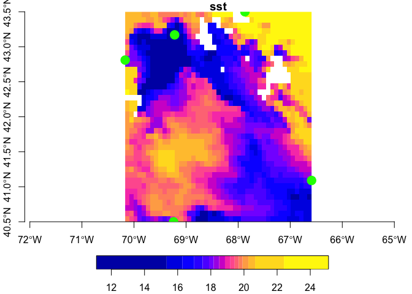

obpg
================

Access OPeNDAP OBPG data from R. Extract point or bounded boxes (as
raster).

Find a catalog of the available OBPG data offerings
[here](https://oceandata.sci.gsfc.nasa.gov/opendap/)

## Requirements

-   [R v4.1+](https://www.r-project.org/)

Packages from CRAN:

-   [rlang](https://CRAN.R-project.org/package=rlang)
-   [dplyr](https://CRAN.R-project.org/package=httr)
-   [sf](https://CRAN.R-project.org/package=sf)
-   [stars](https://CRAN.R-project.org/package=stars)
-   [tidyr](https://CRAN.R-project.org/package=tidyr)
-   [ncdf4](https://CRAN.R-project.org/package=ncdf4)

Packages from Github:

-   [xyzt](https://github.com/BigelowLab/xyzt)

## Installation

    remotes::install_github("BigelowLab/obpg")

### Usage

``` r
suppressPackageStartupMessages({
  library(dplyr)
  library(sf)
  library(stars)
  
  library(xyzt)
  library(obpg)
})
```

#### Working with points.

See the [xyzt](https://github.com/BigelowLab/xyzt) package for more
details on the example Gulf of Maine data.

``` r
# read in example GOM points
x <- xyzt::read_gom() |>
  dplyr::select(-time, -depth) |>
  xyzt::as_POINT()

# generate a MUR url for a given date
url <- obpg_url("2020-07-12")

# open the resource
X <- ncdf4::nc_open(url)

# extract the data 
covars <- obpg::extract(x, X, varname = obpg::obpg_vars(X))

# bind to the input
(y <- dplyr::bind_cols(x, covars))
```

    ## Simple feature collection with 5 features and 4 fields
    ## Geometry type: POINT
    ## Dimension:     XY
    ## Bounding box:  xmin: -70.17 ymin: 40.5 xmax: -66.59 ymax: 43.5
    ## Geodetic CRS:  WGS 84
    ## # A tibble: 5 × 5
    ##   id    name                 geometry qual_sst   sst
    ## * <chr> <chr>             <POINT [°]>    <int> <dbl>
    ## 1 44098 Jeffreys Ledge (-70.17 42.81)        0  19.8
    ## 2 44005 Cashes Ledge   (-69.22 43.17)        0  19.9
    ## 3 44037 Jordan Basin    (-67.87 43.5)        0  17.6
    ## 4 44011 Georges Bank   (-66.59 41.09)        1  23.9
    ## 5 44008 Nantucket SE    (-69.24 40.5)        1  17.3

#### Working with bounding boxes

``` r
x <- xyzt::read_gom() |>
  dplyr::select(-time, -depth) |>
  xyzt::as_BBOX()

covars <- obpg::extract(x, X, varname = obpg::obpg_vars(X))

covars
```

    ## stars object with 2 dimensions and 2 attributes
    ## attribute(s):
    ##           Min. 1st Qu. Median      Mean 3rd Qu.  Max. NA's
    ## sst       11.1  17.505 18.855 18.721258  19.915  25.1   61
    ## qual_sst   0.0   0.000  0.000  9.407018   1.000 255.0    0
    ## dimension(s):
    ##   from to offset      delta refsys point values x/y
    ## x    1 45 -70.17  0.0795556 WGS 84    NA   NULL [x]
    ## y    1 38   43.5 -0.0789474 WGS 84    NA   NULL [y]

Plot the bounding box of data with the points we pulled above:

``` r
x <- xyzt::read_gom() |>
  dplyr::select(-time, -depth) |>
  xyzt::as_POINT()
par(mfrow = c(1,2))
plot(covars, attr = 'sst', col = sf.colors(n=16), axes = TRUE, reset = FALSE)
plot(sf::st_geometry(x), add = TRUE, col = "green", pch = 19, cex = 2)
```

<!-- -->

``` r
# cleanup
ncdf4::nc_close(X)
```
